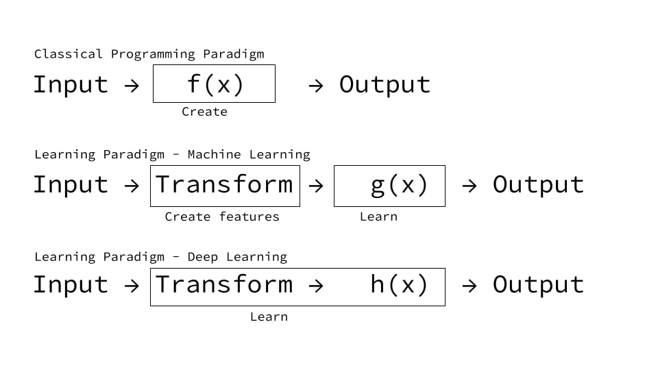
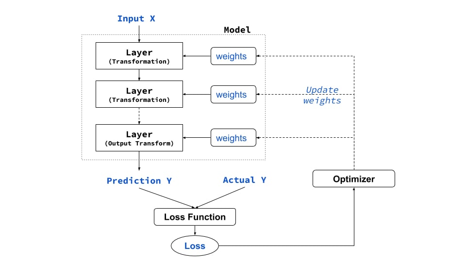
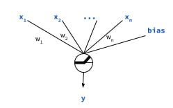

theme: work, 3
slidenumber: true
autoscale: true

[.slidenumber: false]
# [fit] **Getting Started with Deep Learning**
 

*Basic Concepts & Exercise of Deep Learning*

 
AI Conference 2019
San Jose, CA

 

[Amit](https://amitkaps.com) & [Bargava](https://bargava.com)

---

# [fit] **Deep Learning Basics**
- Basic DL Building Blocks
- Guidance on building & training DL models
- **Exercise**: Simple example for DL

---

# **Exercise: Simple DL**
    
- Introduction to **Keras**: Input, Output, Architecture, Loss, Optimizer
- Build simple DL model: Learning a **Noisy Saddle Curve**

$$ Z = 2X^2 - 3Y^2  + 1 + \epsilon $$

---

# **Exercise: Simple DL Continued**

Experiments with the following:
1. Change activation to *linear* and see whether you can predict the function or not 
2. Change *number of layers* in the network
3. Change *number of learning units* in each layer

---

# **Deep Learning Paradigm**

---

# **Learning Types & Applications**

- **Supervised**: Regression, Classification, ...
- **Unsupervised**: Dimensionality Reduction, Clustering, ...
- **Self (semi)-supervised**: Auto-encoders, Generative Adversarial Network, ...
- **Reinforcement Learning**: Games, Self-Driving Car, Robotics, ...

---

# **Deep Learning Build Blocks**

- **Input**: $$X$$
- **Architecture**: Layers, Learning Units, Weights
- **Output**: $$Y_{predicted}$$ 
- **Loss Function**:$$ Lossf(Y_{predicted}, Y_{actual})$$
- **Optimizer Function** 

---

---

# **Data Representation: Tensors**

- Numpy arrays (aka Tensors)
- Generalised form of matrix (2D array)
- Attributes
    - Axes or Rank: `ndim` 
    - Dimensions: `shape` e.g. (5, 3) 
    - Data Type: `dtype` e.g. `float32`, `uint8`, `float64`

---

# **Tensor Types**

- **Scalar**: 0D Tensor
- **Vector**: 1D Tensor
- **Matrix**: 2D Tensor
- **Higher-order**: 3D, 4D or 5D Tensor

---

# **Input $$X$$**

| Tensor | Type     |  Examples    |   Shape | 
|:-------|:---------|:--------------| ---------- | 
| 2D     | Tabular  |  Spreadsheets | (samples, features)   | 
| 3D     | Sequence |  TimeSeries, Text  | (samples, steps, features) |
| 4D     | Spatial  |   Images    | (samples, height, width, channels)    |
| 5D     | Spatial + Sequence   |   Video  | (samples, frames, height, width, channels)    |

---

# **Architecture** 

**Model**
*Sequential*: A linear stack of layers, learnt  in a feed-forward manner

**Layers**
- *Dense Layers*: Fully connected layer of learning units (also called Multi-Layer Perceptron)
- *Basic Layers*: Layers that support basic computation e.g. Flatten, Add, Multiply, DotProduct

---

# **Learning Unit**

$$ y = RELU(dot(w,x) + bias) $$
**weights** are $$ w_1 ... w_n$$ & **activation** is RELU $$ f(z) = max(z,0) $$

---

# **Output $$Y$$ & Loss**

| $$y$$ |  Last Layer Activation |  Loss Function      |
|:-------|:---------|:----------------------|
| Regression     | None   | Mean Square Error   |
| Regression (0-1)    | sigmoid   | MSE or Binary Cross Entropy   |
| Binary-Class     | sigmoid  | Binary Cross Entropy |
| Multi-Class     | softmax | Categorical Cross Entropy   |
| Multi-Class & Multi-Label     | sigmoid   | Binary Crossentropy    |

---

# **Optimizers**

- **SGD**: Excellent but requires tuning learning-rate decay, and momentum parameters 
- **RMSProp**: Good for RNNs
- **Adam**: Adaptive momentum optimiser, generally a good starting point.

---

# Deep Learning Guidance
> *General guidance on building and training neural networks.*
  

> *Treat them as heuristics (derived from experimentation) and as good starting points for your own explorations.*

---

# **Pre-Processing**
- **Normalize** / **Whiten** your data (Not for text!)
- **Scale** your data appropriately (for outlier)
- Handle **Missing Values** - Make them 0 (Ensure it exists in training)
- Create **Training & Validation Split**
- **Stratified** split for multi-class data
- **Shuffle** data for non-sequence data. Careful for sequence!!

---

# **General Architecture**
- Use **ADAM** Optimizer (to start with)
- Use **RELU** for non-linear activation (Faster  for learning than others)
- Add **Bias** to each layer
- Use **Xavier** or **Variance-Scaling** initialisation (Better than random initialisation)
- Refer to output layers activation & loss function guidance for tasks

---

# **Dense / MLP Architecture**
- No. of units reduce in deeper layer
- Units are typically $$2^n$$
- Don't use more than 4 - 5 layers in dense networks

---

# **CNN Architecture (for Images)**
- Increase **Convolution filters** as you go deeper from 32 to 64 or 128 (Max)
- Use **Pooling** to subsample: Makes image robust from translation, scaling, rotation
- Use **pre-trained models** as *feature extractors* for similar tasks
- Progressively **train n-last layers** if the model is not learning
- **Image Augmentation** is key for small data and for faster learning

---

# **RNN / CNN Architecture (for NLP)**

- **Embedding** layer is critical. **Words** are better than **Characters**
- Learn the embedding with the task or use pre-trained embedding as starting point
- Use BiLSTM / LSTM vs Simple RNN. Remember, RNNs are really slow to train
- Experiment with 1D CNN with larger kernel size (7 or 9) than used for images.
- MLP can work with bi-grams for many simple tasks.

---

# **Learning Process**
- **Validation Process**
    - Large Data: Hold-Out Validation 
    - Smaller Data: K-Fold (Stratified) Validation
- **For Underfitting**
  - Add more layers: **go deeper**
  - Make the layers bigger: **go wider**
  - Train for more epochs: **go longer**

---

# **Learning Process**
- **For Overfitting**
  - Get **more training data** (e.g. actual/augmentation)
  - Reduce **model capacity**
  - Add **weight regularisation** (e.g. L1, L2)
  - Add **dropouts** or use **batch normalization**
